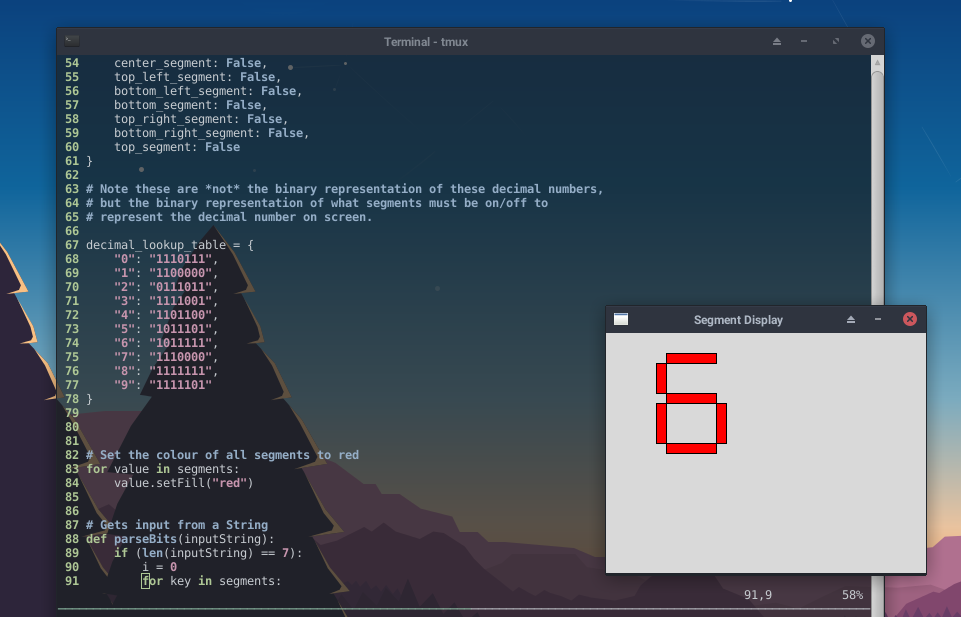

# segdis
Python implementation of a seven-segment display.

|     | Center  | Top Left | Bottom Left | Bottom  | Top Right | Bottom Right |   Top   |
|----------------------|---------|----------|-------------|---------|-----------|--------------|---------|
| Abbreviation | (C)     | (TL)     | (BL)        | (B)     | (TR)      | (BR)         | (T)     |
| Index:       | 1st     | 2nd      | 3rd         | 4th     | 5th       | 6th          | 7th     |
| Binary:      | 1000000 | 0100000  | 0010000     | 0001000 | 0000100   | 0000010      | 0000001 |
